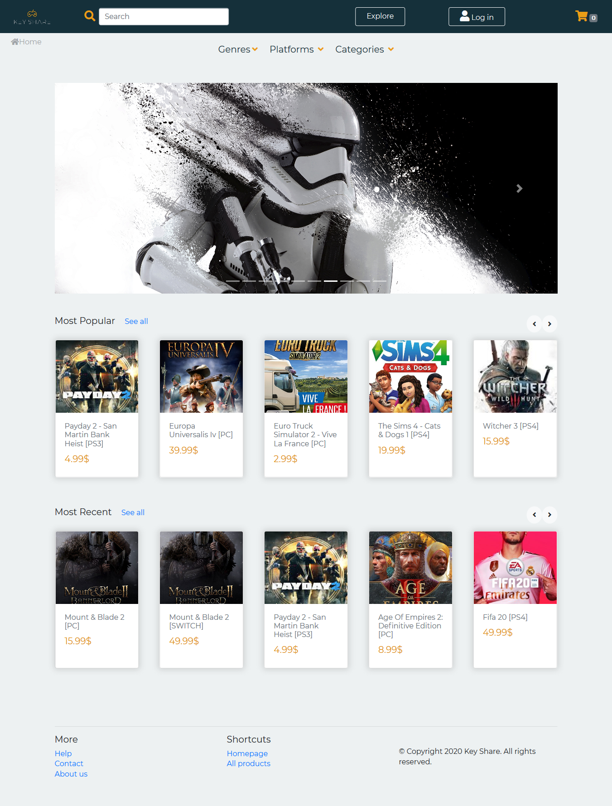
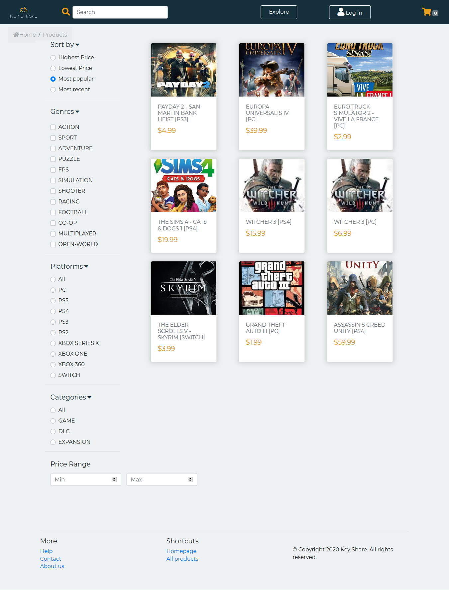
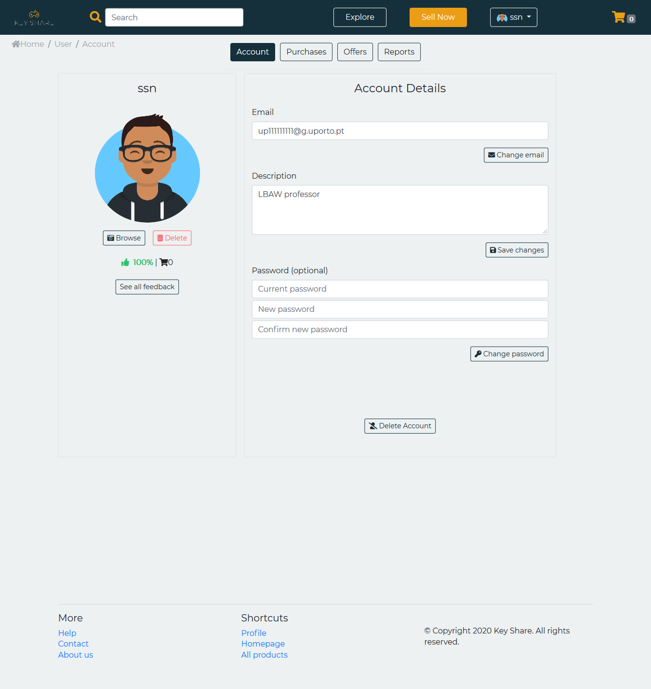
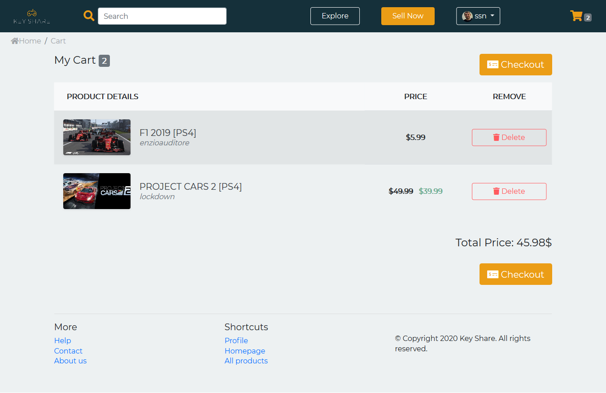

# LBAW

## Gallery

### Homepage
<p align="center">
  
</p>

### Product's listings
<p align="center">
  
</p>

### Product Page
<p align="center">
  
</p>

### Profile
<p align="center">
  
</p>

### Cart
<p align="center">
  
</p>

## Development
[Documentation](https://github.com/motapinto/feup-LBAW/wiki)

### Technologies 
* Laravel
* Socialite
* Paypal API

## How to Run
### Upload and run docker container
```
docker run -it -p 8000:80 -e DB_DATABASE="lbaw2043" -e DB_USERNAME="lbaw2043" -e DB_PASSWORD="AS810664" lbaw2043/lbaw2043
```

**Disclaimer** - This repository was created for educational purposes and we do not take any responsibility for anything related to its content. You are free to use any code or algorithm you find, but do so at your own risk.

